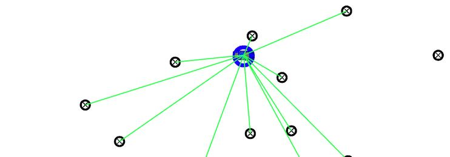
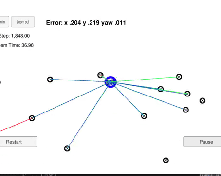

<!-- 
**********************************************************************
https://review.udacity.com/#!/rubrics/747/view
2. Localization, Path Planning, Control, and System Integration
Project Specification
CarND-P6-Kidnapped Vehicle

Accuracy
    1 - Does your particle filter localize the vehicle to within the desired accuracy?: This criteria is checked automatically when you do ./run.sh in the terminal. If the output says "Success! Your particle filter passed!" then it means you’ve met this criteria.

Performance
    2 - Does your particle run within the specified time of 100 seconds?: This criteria is checked automatically when you do ./run.sh in the terminal. If the output says "Success! Your particle filter passed!" then it means you’ve met this criteria.

General:
    3 - Does your code use a particle filter to localize the robot?: There may be ways to “beat” the automatic grader without actually implementing the full particle filter. You will meet this criteria if the methods you write in particle_filter.cpp behave as expected.

**********************************************************************
Note that the programs that need to be written to accomplish the project are src/particle_filter.cpp, and particle_filter.h 
Your job is to build out the methods in `particle_filter.cpp` until the simulator output says: Success! Your particle filter passed!

**********************************************************************
-->

# CarND-P6-Kidnapped_Vehicle
[](http://www.udacity.com/drive)

 

## Overview

In this [project](https://github.com/JohnBetaCode/CarND-P6-Kidnapped_Vehicle) I implemented a 2 dimensional particle filter in C++. The particle filter was be given a map and some initial localization information (analogous to what a GPS would provide). At each time step the filter will also get observation and control data. The robot has been kidnapped and transported to a new location! Luckily it has a map of this location, a (noisy) GPS estimate of its initial location, and lots of (noisy) sensor and control data.

---
## Project Introduction

The Kidnapped Vehicle Project relies heavily on the particle filter approach to localization, particularly "Implementation of a Particle Filter," an upcoming lesson. This leaves the question; How does Markov Localization relate to the Kidnapped Vehicle project?

Markov Localization or Bayes Filter for Localization is a generalized filter for localization and all other localization approaches are realizations of this approach, as we'll discuss later on. By learning how to derive and implement (coding exercises) this filter we develop intuition and methods that will help us solve any vehicle localization task, including implementation of a particle filter. We don't know exactly where our vehicle is at any given time, but can approximate it's location. As such, we generally think of our vehicle location as a probability distribution, each time we move, our distribution becomes more diffuse (wider). We pass our variables (map data, observation data, and control data) into the filter to concentrate (narrow) this distribution, at each time step. Each state prior to applying the filter represents our prior and the narrowed distribution represents our Bayes' posterior.

---
## Particle Filter Results


*1 - Accuracy: Does the particle filter localize the vehicle to within the desired accuracy?*  
*2 - Performance: Does the particle run within the specified time of 100 seconds?*  
*3 - General: Does the code use a particle filter to localize the robot?*

These criteria are checked automatically when ./run.sh is typed in the terminal. If the output says "Success! the particle filter passed!" then it means the project mets all criteria.

### **Results** 

The Particle Filter is implemented in src/particle_filter.cpp:

* Initialization: Particle initialization is implemented at function `ParticleFilter::init()` from line 34 to line 90.
* Prediction: The prediction step is implemented at function `ParticleFilter::prediction()` from line 102 to line 141.
* Weight's update: This is the more important operation in my opinion. It is implemented at function `ParticleFilter::updateWeights()` from line 195
* The rest of black magic happens in [`src/main.cpp`](https://github.com/JohnBetaCode/CarND-P6-Kidnapped_Vehicle/blob/master/src/main.cpp).

 
  

[*CarND-P6-Kidnapped_Vehicle.mp4*](https://github.com/JohnBetaCode/CarND-P6-Kidnapped_Vehicle/blob/master/video_results/particle_filter_test.mp4)   
[*CarND-P6-Kidnapped_Vehicle*](https://youtu.be/-OaUo-mNHwk)   

---
## Running the Code

This project involves the Term 2 Simulator which can be downloaded [here](https://github.com/udacity/self-driving-car-sim/releases). The Term 2 Simulator includes a graphical version of the Kidnapped Vehicle Project. Running the simulator you can see the path that the car drives along with all of its landmark measurements. The simulator can also display the best particle's sensed positions, along with the corresponding map ID associations. This can be extremely helpful to make sure transition and association calculations were done correctly. Notice that the green laser sensors from the car nearly overlap the blue laser sensors from the particle, this means that the particle transition calculations were done correctly. 

Once the scene is loaded you can hit the START button to observe how the car drives and observes landmarks. At any time you can press the PAUSE button, to pause the scene or hit the RESTART button to reset the scene. Also the ARROW KEYS can be used to move the camera around, and the top left ZOOM IN/OUT buttons can be used to focus the camera. Pressing the ESCAPE KEY returns to the simulator main menu

This repository includes two files that can be used to set up and install uWebSocketIO for either Linux or Mac systems. For windows you can use either Docker, VMware, or even Windows 10 Bash on Ubuntu to install uWebSocketIO. The simulator provides the script for the noisy position data, vehicle controls, and noisy observations. The script feeds back the best particle state.

Once the install for uWebSocketIO is complete, the main program can be built and ran by doing the following from the project top directory.

1. mkdir build
2. cd build
3. cmake ..
4. make
5. ./particle_filter

Alternatively some scripts have been included to streamline this process, these can be leveraged by executing the following in the top directory of the project:

1. ./clean.sh
2. ./build.sh
3. ./run.sh

Tips for setting up the environment can be found [here](https://classroom.udacity.com/nanodegrees/nd013/parts/40f38239-66b6-46ec-ae68-03afd8a601c8/modules/0949fca6-b379-42af-a919-ee50aa304e6a/lessons/f758c44c-5e40-4e01-93b5-1a82aa4e044f/concepts/23d376c7-0195-4276-bdf0-e02f1f3c665d)

The program main.cpp has already been filled out, but feel free to modify it.

Here is the main protocol that main.cpp uses for uWebSocketIO in communicating with the simulator.

**INPUT**: values provided by the simulator to the c++ program

// sense noisy position data from the simulator

    ["sense_x"]
    ["sense_y"]
    ["sense_theta"]

// get the previous velocity and yaw rate to predict the particle's transitioned state

    ["previous_velocity"]
    ["previous_yawrate"]

// receive noisy observation data from the simulator, in a respective list of x/y values

    ["sense_observations_x"]
    ["sense_observations_y"]

**OUTPUT**: values provided by the c++ program to the simulator

// best particle values used for calculating the error evaluation

    ["best_particle_x"]
    ["best_particle_y"]
    ["best_particle_theta"]

//Optional message data used for debugging particle's sensing and associations

// for respective (x,y) sensed positions ID label

    ["best_particle_associations"]

// for respective (x,y) sensed positions

    ["best_particle_sense_x"] <= list of sensed x positions
    ["best_particle_sense_y"] <= list of sensed y positions

---
## Implementing the Particle Filter
The directory structure of this repository is as follows:

```
root
|   build.sh
|   clean.sh
|   CMakeLists.txt
|   README.md
|   run.sh
|
|___data
|   |   
|   |   map_data.txt
|   
|___src
    |   helper_functions.h
    |   main.cpp
    |   map.h
    |   particle_filter.cpp
    |   particle_filter.h
```

The only file modified was [`particle_filter.cpp`](https://github.com/JohnBetaCode/CarND-P6-Kidnapped_Vehicle/blob/master/src/particle_filter.cpp) in the [`src`](https://github.com/JohnBetaCode/CarND-P6-Kidnapped_Vehicle/tree/master/src) directory. The file contains the scaffolding of a `ParticleFilter` class and some associated methods. Read through the code, the comments, and the header file [`particle_filter.h`](https://github.com/JohnBetaCode/CarND-P6-Kidnapped_Vehicle/blob/master/src/particle_filter.h) to get a sense for what this code is expected to do.

If you are interested, take a look at [`src/main.cpp`](https://github.com/JohnBetaCode/CarND-P6-Kidnapped_Vehicle/blob/master/src/main.cpp) as well. This file contains the code that will actually be running in the particle filter and calling the associated methods.

---
## Inputs to the Particle Filter

You can find the inputs to the particle filter in the [`data`](https://github.com/JohnBetaCode/CarND-P6-Kidnapped_Vehicle/tree/master/data) directory. The [`map_data.txt`](https://github.com/JohnBetaCode/CarND-P6-Kidnapped_Vehicle/blob/master/data/map_data.txt) includes the position of landmarks (in meters) on an arbitrary Cartesian coordinate system. Each row has three columns:

1. x position
2. y position
3. landmark id

---
> **Date:** &nbsp; 04/21/2019  
> **Programmer:** &nbsp;John A. Betancourt G.   
> **Mail:** &nbsp;john.betancourt93@gmail.com  
> **Web:** &nbsp; www.linkedin.com/in/jhon-alberto-betancourt-gonzalez-345557129 

 

<!-- Sorry for my English -->